[](https://github.com/bm-github/owasp-social-osint-agent/releases/latest)
# 🕵️ owasp-social-osint-agent

**OWASP Social OSINT Agent** is an intelligent, autonomous agent designed for open-source intelligence (OSINT) investigations. It leverages both text and vision-capable Large Language Models (LLMs) via any OpenAI-compatible API to autonomously gather, analyze, and synthesize user activity across single or multiple social media platforms. The final output is a structured analytical report that turns scattered public data into coherent, actionable intelligence.

## 🌟 Key Features

✅ **Multi-Platform Data Collection:** Aggregates data from Twitter/X, Reddit, Bluesky, Hacker News (via Algolia API), and Mastodon (multi-instance support via environment variables).

✅ **AI-Powered Analysis:** Utilises configurable models via OpenAI-compatible APIs for sophisticated text and image analysis.

✅ **Cross-Account Comparison:** Analyze profiles across multiple selected platforms simultaneously.

✅ **Accurate Temporal Analysis:** Injects the current, real-world UTC timestamp into every analysis prompt. This forces the LLM to understand the timeline of events correctly and prevents it from making errors based on its fixed knowledge cutoff date.

✅ **Structured AI Prompts:** Employs detailed system prompts for objective, evidence-based analysis focusing on behavior, semantics, interests, and communication style.

✅ **Vision-Capable Image Analysis:** Analyzes downloaded images (`JPEG, PNG, GIF, WEBP`) for OSINT insights using a vision-enabled LLM, focusing on objective details (setting, objects, people, text, activity). Images are pre-processed (e.g., resized to a max dimension like 1536px, first frame of GIFs).

✅ **Flexible Fetch Control:** Interactively set a default fetch count for all targets. Use the `loadmore` command to incrementally fetch more data for specific users, or define a detailed "Fetch Plan" in programmatic mode to specify exact counts per target.

✅ **Linked Image Analysis:** Each AI-generated image analysis in the final report includes a direct, clickable link to the source image, making it easy to cross-reference and verify findings.

✅ **Shared Domain Analysis:** Automatically extracts all external links shared by a user, counts the frequency of each domain, and includes a "Top Shared Domains" summary in the final report. This reveals the user's information diet, influences, and primary sources.

✅ **Offline Mode (`--offline`):** Run analysis using only locally cached data, ignores cache expiry, skipping all external network requests (social platforms, media downloads, *new* vision analysis).

✅ **Efficient Media Handling:** Downloads media, stores it locally, handles platform-specific authentication (e.g., Twitter Bearer, Bluesky JWT for CDN), processes Reddit galleries, and resizes large images for analysis.

✅ **Intelligent Rate Limit Handling:** Detects API rate limits (especially detailed for Twitter, Mastodon, & LLM APIs, showing reset times), provides informative feedback, and prevents excessive requests. Raises `RateLimitExceededError`.

✅ **Robust Caching System:** Caches fetched data for 24 hours (`data/cache/`) to reduce API calls and speed up subsequent analyses. Media files are cached in `data/media/`.

✅ **Cache Status Overview:** An interactive command (`cache status`) to display a summary of all locally cached user data, including when it was fetched, its age, and item counts.

✅ **Interactive CLI & Docker Support:** User-friendly command-line interface with rich formatting (`rich`) that runs both locally and within a fully containerized Docker environment.

✅ **Programmatic/Batch Mode:** Supports input via JSON from stdin for automated workflows (`--stdin`).

✅ **Secure Environment Variable Configuration:** All secrets and configurations are managed via a `.env` file, following modern security best practices.

✅ **Data Purging:** Interactive option to purge cached text/metadata, media files, or output reports.

## 🗺️ Visual Workflow: How the Agent Thinks

To understand the agent's decision-making process from start to finish, you can explore the detailed workflow flowchart below.

```mermaid
flowchart TD
    %% Initialization
    A([Start owasp-social-osint-agent]) --> AA{{Setup Directories & API Clients<br/>Verify Environment}}
    
    %% Mode Selection
    AA --> B{Interactive or<br/>Stdin Mode?}
    
    %% Interactive Mode Path
    B -->|Interactive| B1([Prompt Auto-Save Setting])
    B1 --> C[/Display Platform Menu/]
    C --> D{Platform<br/>Selection}
    
    %% Platform-Specific Branches
    D -->|Twitter| E1([Twitter])
    D -->|Reddit| E2([Reddit])
    D -->|HackerNews| E3([HackerNews])
    D -->|Bluesky| E4([Bluesky])
    D -->|Mastodon| E5([Mastodon])
    D -->|Cross-Platform| E6([Multiple Platforms])
    D -->|Purge Data| PD([Purge Data])
    PD --> C
    D -->|Cache Status| CS([Cache Status])
    CS --> C
    
    %% Stdin Mode Path
    B -->|Stdin| F([Parse JSON Input])
    F --> GA([Get Auto-Save Setting])
    GA --> G([Extract Platforms & Query])
    
    %% Analysis Loop Entry Points
    E1 --> H([Enter Analysis Loop])
    E2 --> H
    E3 --> H
    E4 --> H
    E5 --> H
    E6 --> H
    G --> J([Run Analysis])
    
    %% Command Processing in Analysis Loop
    H -->|Query Input| I{Command<br/>Type}
    I -->|Analysis Query| J
    I -->|exit| Z([End Session])
    I -->|refresh| Y([Force Refresh Cache])
    Y --> H
    
    %% Data Fetching and Caching
    J --> K{Cache<br/>Available?}
    K -->|Yes| M([Load Cached Data])
    K -->|No| L([Fetch Platform Data])
    
    %% API & Rate Limit Handling
    L --> L1{Rate<br/>Limited?}
    L1 -->|Yes| L2([Handle Rate Limit])
    L2 --> L5([Abort or Retry])
    L1 -->|No| L3([Extract Text & URLs])
    L3 --> L4([Save to Cache])
    
    L4 --> M
    
    %% Parallel Processing Paths
    M --> N([Process Text Data])
    M --> O([Process Media Data])
    
    %% Media Analysis Pipeline
    O --> P([Download Media Files])
    P --> PA{File Exists}
    PA -->|Yes| Q1([Load existing cached File])
    PA -->|No| Q([Image Analysis via LLM])
    
    Q --> R([Collect Media Analysis])
    Q1 --> R
    
    %% Text Formatting and Combining Results
    N --> S([Format Platform Text])
    
    R --> T([Combine All Data])
    S --> T
    
    %% Final Analysis and Output
    T --> U([Call Analysis LLM with Query])
    U --> V([Format Analysis Results])
    
    %% Auto-Save Decision
    V --> V1{Auto-Save<br/>Enabled?}
    
    %% Handle Saving
    V1 -->|Yes| WA([Save Results Automatically])
    WA --> H
    V1 -->|No| WB{Prompt User to Save?}
    WB -->|Yes| WC([Save Results])
    WC --> H
    WB -->|No| H
    
    %% Colorful Styling
    classDef startClass fill:#E8F5E8,stroke:#4CAF50,stroke-width:3px,color:#2E7D32
    classDef setupClass fill:#E3F2FD,stroke:#2196F3,stroke-width:2px,color:#1565C0
    classDef decisionClass fill:#FFF3E0,stroke:#FF9800,stroke-width:2px,color:#E65100
    classDef inputClass fill:#F3E5F5,stroke:#9C27B0,stroke-width:2px,color:#6A1B9A
    classDef menuClass fill:#E8EAF6,stroke:#3F51B5,stroke-width:2px,color:#283593
    
    classDef twitterClass fill:#1DA1F2,stroke:#0D47A1,stroke-width:3px,color:#FFF
    classDef redditClass fill:#FF4500,stroke:#CC3600,stroke-width:3px,color:#FFF
    classDef hnClass fill:#FF6600,stroke:#E55A00,stroke-width:3px,color:#FFF
    classDef bskyClass fill:#00D4FF,stroke:#0099CC,stroke-width:3px,color:#FFF
    classDef mastodonClass fill:#6364FF,stroke:#4F50CC,stroke-width:3px,color:#FFF
    classDef multiClass fill:#4CAF50,stroke:#388E3C,stroke-width:3px,color:#FFF
    classDef purgeClass fill:#F44336,stroke:#D32F2F,stroke-width:3px,color:#FFF
    classDef cacheStatusClass fill:#A5D6A7,stroke:#388E3C,stroke-width:2px,color:#1B5E20
    
    classDef loopClass fill:#E1BEE7,stroke:#8E24AA,stroke-width:2px,color:#4A148C
    classDef analysisClass fill:#BBDEFB,stroke:#1976D2,stroke-width:2px,color:#0D47A1
    classDef cacheClass fill:#B2DFDB,stroke:#00695C,stroke-width:2px,color:#004D40
    classDef apiClass fill:#C8E6C9,stroke:#2E7D32,stroke-width:2px,color:#1B5E20
    classDef errorClass fill:#FFCDD2,stroke:#D32F2F,stroke-width:2px,color:#B71C1C
    classDef dataClass fill:#DCEDC8,stroke:#689F38,stroke-width:2px,color:#33691E
    classDef textClass fill:#E1F5FE,stroke:#0288D1,stroke-width:2px,color:#01579B
    classDef mediaClass fill:#FCE4EC,stroke:#C2185B,stroke-width:2px,color:#880E4F
    classDef llmClass fill:#FFF8E1,stroke:#FFA000,stroke-width:2px,color:#E65100
    classDef outputClass fill:#F1F8E9,stroke:#558B2F,stroke-width:2px,color:#33691E
    classDef endClass fill:#FFEBEE,stroke:#E53935,stroke-width:2px,color:#C62828
    classDef refreshClass fill:#E0F2F1,stroke:#00796B,stroke-width:2px,color:#004D40
    
    %% Apply classes to nodes
    class A startClass
    class AA setupClass
    class B,D,I,K,L1,PA,V1,WB decisionClass
    class B1,F,GA,G inputClass
    class C menuClass
    class E1 twitterClass
    class E2 redditClass
    class E3 hnClass
    class E4 bskyClass
    class E5 mastodonClass
    class E6 multiClass
    class PD purgeClass
    class CS cacheStatusClass
    class H loopClass
    class J analysisClass
    class M cacheClass
    class L,L4 apiClass
    class L2,L5 errorClass
    class T dataClass
    class N,S textClass
    class O,P,Q1,R mediaClass
    class Q,U llmClass
    class V,WA,WC outputClass
    class Z endClass
    class Y refreshClass
```

<details>
<summary><b>➡️ Click to expand the full interactive flowchart</b></summary>


*Flowchart Description Note:* In **Offline Mode (`--offline`)**, the "Fetch Platform Data" step and the "Download Media File" step within the Media Analysis Pipeline are *bypassed* if the data/media is not already in the cache. Analysis proceeds only with available cached information.
</details>

## 🛠 Installation

### Prerequisites
*   **Python 3.8+** and Pip (for local development)
*   **Docker and Docker Compose** (recommended for stable, reproducible environment)

### Steps
1.  **Clone the repository:**
    ```bash
    git clone https://github.com/bm-github/owasp-social-osint-agent.git
    cd owasp-social-osint-agent
    ```
2.  **Set up Configuration (`.env` file):**
    Create a `.env` file in the project root by copying the example below. Fill in your own API keys and credentials.

    ```dotenv
    # .env

    # --- LLM Configuration (Required) ---
    LLM_API_KEY="your_llm_api_key"
    LLM_API_BASE_URL="https://api.example.com/v1" # e.g., https://openrouter.ai/api/v1
    ANALYSIS_MODEL="your_text_analysis_model_name"
    IMAGE_ANALYSIS_MODEL="your_vision_model_name"

    # --- Optional: OpenRouter Specific Headers ---
    # OPENROUTER_REFERER="http://localhost:3000"
    # OPENROUTER_X_TITLE="owasp-social-osint-agent"

    # --- Platform API Keys (as needed) ---
    # Twitter/X
    TWITTER_BEARER_TOKEN="your_twitter_v2_bearer_token"

    # Reddit
    REDDIT_CLIENT_ID="your_reddit_client_id"
    REDDIT_CLIENT_SECRET="your_reddit_client_secret"
    REDDIT_USER_AGENT="YourAppName/1.0 by YourUsername"

    # Bluesky
    BLUESKY_IDENTIFIER="your-handle.bsky.social"
    BLUESKY_APP_SECRET="xxxx-xxxx-xxxx-xxxx" # App Password
    
    # --- Mastodon Instances (as needed) ---
    # Instance 1 (Set one as default for federated lookups)
    MASTODON_INSTANCE_1_URL="https://mastodon.social"
    MASTODON_INSTANCE_1_TOKEN="YOUR_ACCESS_TOKEN_FOR_MASTODON_SOCIAL"
    MASTODON_INSTANCE_1_DEFAULT="true"

    # Instance 2
    MASTODON_INSTANCE_2_URL="https://another.instance.org"
    MASTODON_INSTANCE_2_TOKEN="YOUR_ACCESS_TOKEN_FOR_THE_OTHER_INSTANCE"
    ```
    *Note: HackerNews does not require API keys.*

## 🚀 Usage

### Recommended: Docker Mode

This is the most stable and reproducible way to run the agent.

1.  **Build the Docker image:**
    ```bash
    docker-compose build
    ```
2.  **Run in Interactive Mode:**
    ```bash
    docker-compose run --rm social-osint-agent
    ```
3.  **Run in Programmatic Mode (via Stdin):**
    ```bash
    echo '{
      "platforms": { "hackernews": ["pg"] },
      "query": "What are Paul Graham's main interests?"
    }' | docker-compose run --rm -T social-osint-agent --stdin
    ```

### Local Development Mode

1.  **Install dependencies:**
    ```bash
    pip install -r requirements.txt
    ```
2.  **Run the script:**
    (Ensure your `.env` file is in the project root)
    ```bash
    python -m socialosintagent.main
    ```

### Command-line Arguments
*   `--stdin`: Read analysis configuration from standard input as a JSON object.
*   `--format [json|markdown]`: Specifies the output format when saving results (default: `markdown`).
*   `--no-auto-save`: Disable automatic saving of reports.
*   `--log-level [DEBUG|INFO|WARNING|ERROR|CRITICAL]`: Set the logging level (default: `WARNING`).
*   `--offline`: Run in offline mode. Uses only cached data.

### Special Commands (Interactive Mode)
Within the analysis session, you can use these commands instead of an analysis query:
*   `loadmore [<platform/user>] <count>`: Fetch additional items. If the target is unambiguous (only one user is being analyzed), you can omit `<platform/user>`. Examples: `loadmore 100`, `loadmore reddit/user123 50`.
*   `refresh`: Re-fetch data for all targets, ignoring the 24-hour cache.
*   `help`: Displays available commands in the analysis session.
*   `exit`: Returns to the main platform selection menu.

## ⚡ Cache System
*   **Text/API Data:** Fetched platform data is cached for **24 hours** in `data/cache/` as JSON files (`{platform}_{username}.json`). This minimizes redundant API calls.
*   **Media Files:** Downloaded images and media are stored in `data/media/` using hashed filenames (e.g., `{url_hash}.jpg`). These are not automatically purged but are reused if the same URL is encountered.
*   In **Offline Mode (`--offline`)**, the cache is used as the exclusive data source. No new data is fetched, and the cache expiry is ignored.
*   Use the `refresh` command in interactive mode to force a bypass of the cache for the current session.
*   Use the "Purge Data" or "Cache Status" options in the main interactive menu to manage and inspect your local cache.

## 🔍 Error Handling & Logging
*   **Rate Limits:** Detects API rate limits and provides informative feedback.
*   **API Errors:** Handles common platform-specific errors (e.g., user not found, forbidden access).
*   **Logging:** Detailed errors and warnings are logged to `analyzer.log`. The log level can be configured using the `--log-level` argument.

## 🤖 AI Analysis Details
*   **Accurate Timestamps:** The tool injects the current, real-world UTC timestamp into the analysis prompt. This prevents the LLM from making temporal errors due to its fixed knowledge cutoff date.
*   **Data Synthesis:** The final analysis is performed by an LLM guided by a detailed system prompt. It synthesizes insights from the user's text, the linked image analyses, and the shared domain summary to build a comprehensive profile and answer the user's query.

## 🔒 Security Considerations
*   **API Keys:** All secrets (API keys, tokens, etc.) should be stored in the `.env` file. This file should be secured and **never** committed to version control. Ensure `.env` is listed in your `.gitignore` file.
*   **Data Caching:** Fetched data and downloaded media are stored locally in the `data/` directory. Be mindful of the sensitivity of the data being analyzed and secure the directory appropriately.
*   **Terms of Service:** Ensure your use of the tool complies with the Terms of Service of each social media platform and your chosen LLM API provider.

## 🤝 Contributing
Contributions are welcome! Please feel free to submit pull requests, report issues, or suggest enhancements via the project's issue tracker.

## 📜 License
This project is licensed under the **MIT License**.