[](https://github.com/bm-github/owasp-social-osint-agent/releases/latest)
# 🕵️ owasp-social-osint-agent

**OWASP Social OSINT Agent** is an intelligent, autonomous agent designed for open-source intelligence (OSINT) investigations. It leverages both text and vision-capable Large Language Models (LLMs) via any OpenAI-compatible API to autonomously gather, analyze, and synthesize user activity across single or multiple social media platforms. The final output is a structured analytical report that turns scattered public data into coherent, actionable intelligence.

## 🌟 Key Features

✅ **Multi-Platform Data Collection:** Aggregates data from Twitter/X, Reddit, Bluesky, GitHub, Hacker News, and Mastodon. Captures immutable identifiers (e.g., Bluesky DIDs) to ensure targets can be tracked even if they change their handles.

✅ **High-Fidelity OSINT Extraction:** Goes beyond basic text to capture platform-specific intelligence, including GitHub commit messages/star events, Reddit karma breakdowns/subreddit contexts, Twitter location/verified status, and HackerNews user reputation.

✅ **AI-Powered Analysis:** Utilises configurable models via OpenAI-compatible APIs for sophisticated text and image analysis. Employs externalized, easily editable prompt files.

✅ **Efficient Two-Phase Analysis:** The agent first fetches all textual data and downloads all media across all targets. Only after all data collection is complete does it begin the (slower) vision analysis phase, ensuring maximum efficiency.

✅ **Cross-Account Comparison:** Analyze profiles across multiple selected platforms simultaneously.

✅ **Robust Error Handling:** Individual fetch or image analysis failures don't crash the entire pipeline. The agent gracefully degrades, providing partial results when some targets are unavailable.

✅ **Unified Platform Architecture:** All platform fetchers use a consistent base class pattern, ensuring uniform error handling, pagination, and caching behavior across Twitter, Reddit, Bluesky, GitHub, Mastodon, and HackerNews.

✅ **Indirect Injection Mitigation:** Robustly wraps untrusted social media data in structured XML tags within the LLM prompt. This clarifies the boundary between "system instructions" and "untrusted data," helping to mitigate indirect prompt injection attacks hidden in social posts or image descriptions.

✅ **Accurate Temporal Analysis:** Injects the current, real-world UTC timestamp into every analysis prompt, forcing the LLM to understand the timeline of events correctly.

✅ **Structured AI Prompts:** Employs detailed system prompts for objective, evidence-based analysis focusing on behavior, semantics, interests, and communication style.

✅ **Vision-Capable Image Analysis:** Analyzes downloaded images (`JPEG, PNG, GIF, WEBP`) for OSINT insights using a vision-enabled LLM.

✅ **Flexible Fetch Control:** Interactively set a default fetch count for all targets and use the `loadmore` command to incrementally fetch more data for specific users.

✅ **Linked Image Analysis:** Each AI-generated image analysis in the final report includes a direct, clickable link to the source image, making it easy to cross-reference and verify findings.

✅ **Shared Domain Analysis:** Automatically extracts all external links shared by a user, counts the frequency of each domain, and includes a "Top Shared Domains" summary in the final report.

✅ **Offline Mode (`--offline`):** Run analysis using only locally cached data. Skips all external network requests.

✅ **Intelligent Rate Limit Handling:** Detects API rate limits from social platforms and LLM providers, provides informative feedback, and prevents excessive requests.

✅ **Robust Caching System:** Caches fetched text data for 24 hours (`data/cache/`) and media files (`data/media/`) to reduce API calls and speed up subsequent analyses. Vision analysis results are also cached.

✅ **Cache Management:** Interactive commands (`cache status`, `purge data`) to display a summary of all cached data or to purge specific types of data.

✅ **Interactive CLI & Docker Support:** User-friendly command-line interface with rich formatting that runs both locally and within a fully containerized Docker environment.

✅ **Programmatic/Batch Mode:** Supports input via JSON from stdin for automated workflows (`--stdin`).

✅ **Secure Environment Variable Configuration:** All secrets and configurations are managed via a `.env` file.

## 🗺️ Visual Workflow: How the Agent Thinks

To understand the agent's decision-making process from start to finish, you can explore the detailed workflow flowchart below.

```mermaid
flowchart TD
    %% Initialization
    A([Start owasp-social-osint-agent]) --> AA{{Setup Directories & API Clients<br/>Verify Environment}}
    
    %% Mode Selection
    AA --> B{Interactive or<br/>Stdin Mode?}
    
    %% Interactive Mode Path
    B -->|Interactive| C[/Display Platform Menu/]
    C --> D{Platform<br/>Selection}
    
    %% Platform-Specific Branches
    D -->|Twitter| E1([Twitter])
    D -->|Reddit| E2([Reddit])
    D -->|HackerNews| E3([HackerNews])
    D -->|Bluesky| E4([Bluesky])
    D -->|Mastodon| E5([Mastodon])
    D -->|GitHub| E7([GitHub])
    D -->|Cross-Platform| E6([Multiple Platforms])
    D -->|Purge Data| PD([Purge Data])
    PD --> C
    D -->|Cache Status| CS([Cache Status])
    CS --> C
    
    %% Stdin Mode Path
    B -->|Stdin| F([Parse JSON Input])
    F --> G([Extract Platforms & Query])
    
    %% Analysis Loop Entry Points
    E1 --> H([Enter Analysis Loop])
    E2 --> H
    E3 --> H
    E4 --> H
    E5 --> H
    E7 --> H
    E6 --> H
    G --> J([Run Analysis])
    
    %% Command Processing in Analysis Loop
    H -->|Query Input| I{Command<br/>Type}
    I -->|Analysis Query| J
    I -->|exit| Z([End Session])
    I -->|refresh| Y([Force Refresh Cache])
    Y --> H
    
    %% PHASE 1: Data Fetching and Caching
    J --> K{Cache<br/>Available?}
    K -->|Yes| M([Load Cached Data])
    K -->|No| L([Fetch Platform Data<br/>& Download Media])
    
    %% API & Rate Limit Handling for Fetching
    L --> L1{Rate<br/>Limited?}
    L1 -->|Yes| L2([Handle Rate Limit])
    L2 --> L5([Abort or Retry])
    L1 -->|No| L3([Extract Text & URLs])
    L3 --> L4([Save to Cache])
    L4 --> M
    
    %% Data Consolidation Point
    M --> N([Consolidate All<br/>Fetched Data])
    
    %% PHASE 2: Vision Analysis
    N --> O{Any Images<br/>Need Analysis?}
    O -->|Yes| P([Analyze Images via Vision LLM])
    P --> P1([Update Cache with<br/>Vision Analysis Results])
    P1 --> Q
    O -->|No| Q
    
    %% Data Formatting & Final Synthesis
    Q([Format Text, Links &<br/>Vision Data for LLM]) --> S([Call Text Analysis LLM<br/>with Query and All Data])
    
    %% Output Generation
    S --> T([Format Final Report])
    T --> V1{Auto-Save<br/>Enabled?}
    
    %% Handle Saving
    V1 -->|Yes| WA([Save Results Automatically])
    WA --> H
    V1 -->|No| WB{Prompt User to Save?}
    WB -->|Yes| WC([Save Results])
    WC --> H
    WB -->|No| H
    
    classDef startClass fill:#E8F5E8,stroke:#4CAF50,stroke-width:3px,color:#2E7D32
    classDef setupClass fill:#E3F2FD,stroke:#2196F3,stroke-width:2px,color:#1565C0
    classDef decisionClass fill:#FFF3E0,stroke:#FF9800,stroke-width:2px,color:#E65100
    classDef inputClass fill:#F3E5F5,stroke:#9C27B0,stroke-width:2px,color:#6A1B9A
    classDef menuClass fill:#E8EAF6,stroke:#3F51B5,stroke-width:2px,color:#283593
    classDef twitterClass fill:#1DA1F2,stroke:#0D47A1,stroke-width:3px,color:#FFF
    classDef redditClass fill:#FF4500,stroke:#CC3600,stroke-width:3px,color:#FFF
    classDef hnClass fill:#FF6600,stroke:#E55A00,stroke-width:3px,color:#FFF
    classDef bskyClass fill:#00D4FF,stroke:#0099CC,stroke-width:3px,color:#FFF
    classDef mastodonClass fill:#6364FF,stroke:#4F50CC,stroke-width:3px,color:#FFF
    classDef githubClass fill:#24292e,stroke:#000,stroke-width:3px,color:#FFF
    classDef multiClass fill:#4CAF50,stroke:#388E3C,stroke-width:3px,color:#FFF
    classDef purgeClass fill:#F44336,stroke:#D32F2F,stroke-width:3px,color:#FFF
    classDef cacheStatusClass fill:#A5D6A7,stroke:#388E3C,stroke-width:2px,color:#1B5E20
    classDef loopClass fill:#E1BEE7,stroke:#8E24AA,stroke-width:2px,color:#4A148C
    classDef analysisClass fill:#BBDEFB,stroke:#1976D2,stroke-width:2px,color:#0D47A1
    classDef cacheClass fill:#B2DFDB,stroke:#00695C,stroke-width:2px,color:#004D40
    classDef apiClass fill:#C8E6C9,stroke:#2E7D32,stroke-width:2px,color:#1B5E20
    classDef errorClass fill:#FFCDD2,stroke:#D32F2F,stroke-width:2px,color:#B71C1C
    classDef dataClass fill:#DCEDC8,stroke:#689F38,stroke-width:2px,color:#33691E
    classDef llmClass fill:#FFF8E1,stroke:#FFA000,stroke-width:2px,color:#E65100
    classDef outputClass fill:#F1F8E9,stroke:#558B2F,stroke-width:2px,color:#33691E
    classDef endClass fill:#FFEBEE,stroke:#E53935,stroke-width:2px,color:#C62828
    classDef refreshClass fill:#E0F2F1,stroke:#00796B,stroke-width:2px,color:#004D40
    
    class A startClass; class AA setupClass; class B,D,I,K,L1,O,V1,WB decisionClass
    class C menuClass; class H loopClass; class J,P,S llmClass; class L,L4 apiClass
    class M,P1 cacheClass; class L2,L5 errorClass; class N,Q dataClass
    class T,WA,WC outputClass; class Z endClass; class Y refreshClass
    class E1 twitterClass; class E2 redditClass; class E3 hnClass; class E4 bskyClass; class E5 mastodonClass; class E6 multiClass; class E7 githubClass
    class PD purgeClass; class CS cacheStatusClass; class F,G inputClass
```

<details>
<summary><b>➡️ Click to expand the full interactive flowchart</b></summary>


*Flowchart Description Note:* In **Offline Mode (`--offline`)**, the "Fetch Platform Data" step and the "Analyze Images" step are both *bypassed*. The analysis proceeds only with information already available in the local cache.
</details>

## 🛠 Installation

### Prerequisites
*   **Docker and Docker Compose** (Recommended)
*   **Python 3.11+** and Pip (for local development)

### 1. Clone the Repository
```bash
git clone https://github.com/bm-github/owasp-social-osint-agent.git
cd owasp-social-osint-agent
```

### 2. Configure Environment Variables
Create a `.env` file in the project root by copying the example file (`env.example`). Then, fill in your own API keys and credentials.
```bash
cp env.example .env
# Now edit the .env file with your secrets
```

```dotenv
# .env

# --- LLM Configuration (Required) ---
LLM_API_KEY="your_llm_api_key"
LLM_API_BASE_URL="https://api.example.com/v1" # e.g., https://openrouter.ai/api/v1
ANALYSIS_MODEL="your_text_analysis_model_name"
IMAGE_ANALYSIS_MODEL="your_vision_model_name"

# --- Optional: OpenRouter Specific Headers ---
# OPENROUTER_REFERER="http://localhost:3000"
# OPENROUTER_X_TITLE="owasp-social-osint-agent"

# --- Platform API Keys (as needed) ---
# Twitter/X
TWITTER_BEARER_TOKEN="your_twitter_v2_bearer_token"
# Reddit
REDDIT_CLIENT_ID="your_reddit_client_id"
REDDIT_CLIENT_SECRET="your_reddit_client_secret"
REDDIT_USER_AGENT="YourAppName/1.0 by YourUsername"
# Bluesky
BLUESKY_IDENTIFIER="your-handle.bsky.social"
BLUESKY_APP_SECRET="xxxx-xxxx-xxxx-xxxx"
# GitHub
GITHUB_TOKEN="your_github_personal_access_token"
# Mastodon Multi-Instance Support
# Configure credentials for each Mastodon instance you want to access
# The DEFAULT instance is used as a fallback when looking up users from unconfigured instances
# Recommendation: Set a large, well-federated instance (like mastodon.social) as default

MASTODON_INSTANCE_1_URL="https://mastodon.social"
MASTODON_INSTANCE_1_TOKEN="YOUR_ACCESS_TOKEN_FOR_MASTODON_SOCIAL"
MASTODON_INSTANCE_1_DEFAULT="true"  # Use this instance for cross-instance lookups

# Add more instances as needed (increment the number)
# MASTODON_INSTANCE_2_URL="https://infosec.exchange"
# MASTODON_INSTANCE_2_TOKEN="YOUR_ACCESS_TOKEN_FOR_INFOSEC_EXCHANGE"

# MASTODON_INSTANCE_3_URL="https://fosstodon.org"
# MASTODON_INSTANCE_3_TOKEN="YOUR_ACCESS_TOKEN_FOR_FOSSTODON"

# Security: Media Download Restrictions
# By default, only trusted CDNs are allowed. Override with additional domains:
# EXTRA_TWITTER_CDNS="custom.cdn.example.com"
# EXTRA_REDDIT_CDNS="i.imgur.com,custom.cdn2.com"
# EXTRA_BLUESKY_CDNS="custom.bsky.cdn.com"
# EXTRA_MASTODON_CDNS="media.myinstance.org"
```
*Note: HackerNews does not require API keys. GitHub can run in a limited, unauthenticated mode but a token is recommended.*

## 🚀 Usage

There are two ways to run the agent: via Docker (recommended) or locally in a Python environment.

### Recommended: Docker Mode
This is the most stable and reproducible way to run the agent. It ensures all dependencies are handled correctly.

1.  **Build the Docker image:**
    ```bash
    docker-compose build
    ```
2.  **Run in Interactive Mode:**
    This starts the interactive command-line interface.
    ```bash
    docker-compose run --rm social-osint-agent
    ```
3.  **Run in Programmatic Mode (via Stdin):**
    Pipe a JSON object to the agent for automated workflows.
    ```bash
    echo '{
      "platforms": { "hackernews": ["pg"], "github": ["torvalds"] },
      "query": "What are the primary technical interests and contributions of these users?"
    }' | docker-compose run --rm -T social-osint-agent --stdin
    ```

### Local Development Mode
This is useful for development and debugging if you prefer not to use Docker.

1.  **Create a Virtual Environment (Recommended):**
    ```bash
    python -m venv .venv
    source .venv/bin/activate  # On Windows, use `.venv\Scripts\activate`
    ```
2.  **Install Dependencies:**
    ```bash
    pip install -r requirements-dev.txt
    ```
3.  **Run the Agent:**
    (Ensure your `.env` file is in the project root)
    ```bash
    python -m socialosintagent.main
    ```

### Command-line Arguments
*   `--stdin`: Read analysis configuration from standard input as a JSON object.
*   `--format [json|markdown]`: Specifies the output format when saving results (default: `markdown`).
*   `--no-auto-save`: Disable automatic saving of reports.
*   `--log-level [DEBUG|INFO|WARNING|ERROR|CRITICAL]`: Set the logging level (default: `WARNING`).
*   `--offline`: Run in offline mode. Uses only cached data.
*   `--unsafe-allow-external-media`: **Security:** Allow downloading media from domains outside of known social media CDNs (e.g., personal servers or third-party websites).

### Special Commands (Interactive Mode)
Within the analysis session, you can use these commands instead of an analysis query:
*   `/loadmore [<platform/user>] <count>`: Fetch additional items for a target. If the target is unambiguous, you can omit `<platform/user>`.
*   `/refresh`: Re-fetch data for all targets, ignoring the 24-hour cache.
*   `/help`: Displays available commands.
*   `/exit`: Returns to the main platform selection menu.
**Note:** Commands can be prefixed with `/` for clarity (e.g., `/help`, `/exit`), though the unprefixed versions still work for backward compatibility.

## ⚡ Cache System
*   **Text/API Data:** Fetched platform data is cached for **24 hours** in `data/cache/` as JSON files.
*   **Media Files:** Downloaded images and media are stored in `data/media/`.
*   **Vision Analysis:** AI-generated image analyses are saved back into the corresponding user's cache file, preventing re-analysis of the same image.
*   Use the `refresh` command in interactive mode to force a re-fetch of text data. Use "Purge Data" to clear media files.

## 🤖 AI Analysis Details
*   **Efficient Architecture:** The agent uses a two-phase process. It first rapidly collects all text data and downloads media from all specified targets. Only after this data gathering is complete does it begin the vision analysis phase.
*   **Externalized Prompts:** All prompts used to guide the LLM are stored in the `socialosintagent/prompts/` directory, allowing for easy customization without changing code.
*   **Accurate Timestamps:** The tool injects the current, real-world UTC timestamp into the analysis prompt, preventing the LLM from making temporal errors due to its fixed knowledge cutoff date.
*   **Data Synthesis:** The final analysis is performed by an LLM guided by a detailed system prompt. It synthesizes insights from the user's text, image analyses, and shared domain summary to build a comprehensive profile.

## 🛡️ Error Handling & Resilience
- **Individual Target Failures**: If one user's data can't be fetched (deleted account, rate limit, permissions), analysis continues for other targets
- **Image Analysis Failures**: Individual image processing errors don't stop the entire vision analysis batch
- **Rate Limit Management**: The agent detects rate limits, provides informative feedback with reset times, and continues with cached data when available
- **Partial Results**: You'll receive analysis based on whatever data was successfully collected, with clear indication of any failures

## 🔒 Security Considerations
*   **API Keys:** All secrets should be stored in the `.env` file. This file should be secured and **never** committed to version control.
*   **Data Caching:** Fetched data and downloaded media are stored locally in the `data/` directory. Be mindful of the sensitivity of the data being analyzed and secure the directory appropriately.
*   **Terms of Service:** Ensure your use of the tool complies with the Terms of Service of each social media platform and your chosen LLM API provider.

## 🤝 Contributing
Contributions are welcome! Please feel free to submit pull requests, report issues, or suggest enhancements via the project's issue tracker.

## 📜 License
This project is licensed under the **MIT License**.
