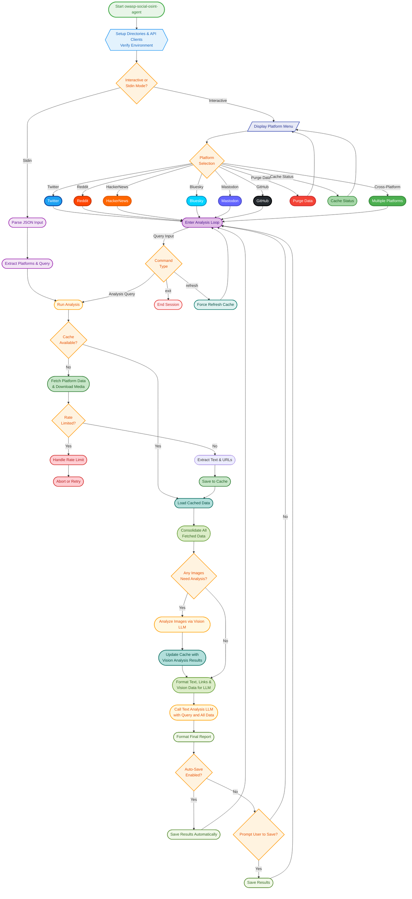

[](https://github.com/bm-github/owasp-social-osint-agent/releases/latest)
[](https://bm-github.github.io/owasp-social-osint-agent/socialosintagent-demo.html)

# 🕵️ owasp-social-osint-agent

**OWASP Social OSINT Agent** is an intelligent, autonomous agent designed for open-source intelligence (OSINT) investigations. It leverages both text and vision-capable Large Language Models (LLMs) via any OpenAI-compatible API to autonomously gather, analyze, and synthesize user activity across single or multiple social media platforms. The final output is a structured analytical report that turns scattered public data into coherent, actionable intelligence.

The agent can be driven through a **web interface** (recommended) or a **command-line interface**, both backed by the same engine and sharing the same data cache.

## 🎮 Live Demo

**Try it instantly — no installation required.**

[](https://bm-github.github.io/owasp-social-osint-agent/socialosintagent-demo.html)

The [interactive demo](https://bm-github.github.io/owasp-social-osint-agent/socialosintagent-demo.html) runs entirely in your browser with pre-loaded investigation data — no backend, no API keys, no Docker required. It showcases the full web UI including:

- **Session management** with two pre-loaded example investigations
- **Analysis reports** rendered from realistic mock OSINT data
- **Network contact graph** (D3 force-directed) showing target relationships
- **Chronological activity chart** and **Pattern of Life heatmap** (day × hour)
- **Entity extraction** panel (locations, emails, crypto addresses, aliases)
- **Media analysis** thumbnails with simulated vision-LLM annotations
- **Live progress stream** simulation — run your own queries against the demo data

> The demo uses pre-canned data to illustrate the interface. The real system performs live API fetching, LLM synthesis, vision analysis, and prompt-injection-hardened processing against actual social platforms.

## 🌟 Key Features

✅ **Web Interface:** A browser-based UI at `http://localhost:8000` for managing sessions, running queries, and reviewing reports — no terminal required.

✅ **Session Management:** Save and revisit named investigation sessions, each with their own target list, query history, and full report archive.

✅ **Network Contact Discovery:** Automatically extracts and surfaces accounts your targets interact with (mentions, retweets, repo interactions) so you can expand an investigation without manual trawling. Discovered contacts can be dismissed or promoted directly to active targets from the web UI.

✅ **Multi-Platform Data Collection:** Aggregates data from Twitter/X, Reddit, Bluesky, GitHub, Hacker News, and Mastodon. Captures immutable identifiers (e.g., Bluesky DIDs) to ensure targets can be tracked even if they change their handles.

✅ **High-Fidelity OSINT Extraction:** Goes beyond basic text to capture platform-specific intelligence, including GitHub commit messages/star events, Reddit karma breakdowns/subreddit contexts, Twitter location/verified status, and HackerNews user reputation.

✅ **AI-Powered Analysis:** Utilises configurable models via OpenAI-compatible APIs for sophisticated text and image analysis. Employs externalized, easily editable prompt files.

✅ **Efficient Two-Phase Analysis:** The agent first fetches all textual data and downloads all media across all targets. Only after all data collection is complete does it begin the (slower) vision analysis phase, ensuring maximum efficiency.

✅ **Cross-Account Comparison:** Analyze profiles across multiple selected platforms simultaneously.

✅ **Robust Error Handling:** Individual fetch or image analysis failures don't crash the entire pipeline. The agent gracefully degrades, providing partial results when some targets are unavailable.

✅ **Unified Platform Architecture:** All platform fetchers use a consistent base class pattern, ensuring uniform error handling, pagination, and caching behavior across Twitter, Reddit, Bluesky, GitHub, Mastodon, and HackerNews.

✅ **Indirect Injection Mitigation:** Robustly wraps untrusted social media data in structured XML tags within the LLM prompt. This clarifies the boundary between "system instructions" and "untrusted data," helping to mitigate indirect prompt injection attacks hidden in social posts or image descriptions.

✅ **Accurate Temporal Analysis:** Injects the current, real-world UTC timestamp into every analysis prompt, forcing the LLM to understand the timeline of events correctly.

✅ **Structured AI Prompts:** Employs detailed system prompts for objective, evidence-based analysis focusing on behavior, semantics, interests, and communication style.

✅ **Vision-Capable Image Analysis:** Analyzes downloaded images (`JPEG, PNG, GIF, WEBP`) for OSINT insights using a vision-enabled LLM.

✅ **Flexible Fetch Control:** Interactively set a default fetch count for all targets and use the `loadmore` command to incrementally fetch more data for specific users.

✅ **Linked Image Analysis:** Each AI-generated image analysis in the final report includes a direct, clickable link to the source image, making it easy to cross-reference and verify findings.

✅ **Shared Domain Analysis:** Automatically extracts all external links shared by a user, counts the frequency of each domain, and includes a "Top Shared Domains" summary in the final report.

✅ **Offline Mode (`--offline`):** Run analysis using only locally cached data. Skips all external network requests.

✅ **Intelligent Rate Limit Handling:** Detects API rate limits from social platforms and LLM providers, provides informative feedback, and prevents excessive requests.

✅ **Robust Caching System:** Caches fetched text data for 24 hours (`data/cache/`) and media files (`data/media/`) to reduce API calls and speed up subsequent analyses. Vision analysis results are also cached.

✅ **Cache Management:** View a summary of all cached data or purge specific types from the web UI or interactive CLI commands.

✅ **Interactive CLI & Docker Support:** User-friendly command-line interface with rich formatting that runs both locally and within a fully containerized Docker environment.

✅ **Programmatic/Batch Mode:** Supports input via JSON from stdin for automated workflows (`--stdin`).

✅ **Secure Environment Variable Configuration:** All secrets and configurations are managed via a `.env` file.

## 🌐 Web Interface

The web interface provides a full browser-based investigation environment that requires no terminal interaction after startup.

> **Want to see it before installing?** Check out the [interactive demo](https://bm-github.github.io/owasp-social-osint-agent/socialosintagent-demo.html) — it runs in your browser with no setup required.

### Starting the web server

```bash
docker compose up -d web
```

Then open `http://localhost:8000` in your browser. The image is built automatically on first run.

### Web UI features at a glance

**Sessions panel (left sidebar)**
- Create named investigation sessions; each has its own target list, query history, and report archive
- Sessions persist across server restarts — pick up where you left off
- Rename sessions inline by clicking the title
- Delete sessions you no longer need

**Target chips bar**
- Add or remove platforms/usernames at any time using the chip bar above the query input
- Each chip shows a colour-coded freshness dot (green = fresh cache, amber = stale, grey = not yet fetched)
- Clicking × on a chip removes that target from the session immediately

**Query bar**
- Type a natural language query and press **Run Analysis** (or `Ctrl+Enter`)
- Set the number of posts to fetch per target with the **Posts** counter
- Toggle **Force refresh** to bypass the 24-hour cache and re-fetch live data

**Live progress stream**
- Analysis progress streams to the browser in real time via Server-Sent Events
- Each stage (data fetch → image analysis → LLM synthesis) is logged as it happens
- If you reload the page mid-analysis the browser reconnects and replays all events so far

**Report panel (centre)**
- Reports render as styled Markdown with clickable image links
- Switch between the **Report** tab and the **Timeline** tab at any time
- **Download MD** saves the current report as a Markdown file
- The full-session **Export Full Report** button produces a single consolidated Markdown document covering every query in the session, all extracted entities, and the top network contacts

**Query history sidebar**
- Every query and its full report is preserved in the session
- Click any history entry to re-display its report without re-running the analysis

**Timeline tab**
- **Chronological Activity** — bar chart of post volume over calendar time using D3
- **Pattern of Life** — day-of-week × hour-of-day heatmap (UTC) showing when targets are most active

**Contacts panel (right panel, Contacts tab)**
- Lists all accounts your targets mention, retweet, reply to, or interact with via repos
- A force-directed network graph shows the relationships visually
- Contacts are ranked by interaction weight
- **+ button** promotes a contact to an active session target in one click
- **× button** dismisses a contact; it will not reappear on subsequent loads (reversible)
- Filter contacts by name or platform using the search box

**Entities tab**
- Extracts and displays structured intelligence selectors from the latest analysis: locations, email addresses, phone numbers, cryptocurrency addresses, and aliases

**Media tab**
- Shows thumbnails of all images downloaded for the current session's targets
- Hover over a thumbnail to reveal the LLM vision analysis for that image

**Cache manager**
- Opened from the top bar **Cache** button
- Shows every cached target with post count and freshness status
- Select individual targets to purge, or wipe everything (cache + media + outputs) in one click

### Remote access

The server binds to `127.0.0.1:8000` (localhost only) by default. To access it from another machine, use an SSH tunnel:

```bash
ssh -L 8000:localhost:8000 user@your-server
```

Then open `http://localhost:8000` locally.

### Authentication

Set `OSINT_WEB_USER` and `OSINT_WEB_PASSWORD` in your `.env` file to enable HTTP Basic Auth. If these are not set the server runs open — only appropriate for localhost use via SSH tunnel.

## 🗺️ Visual Workflow: How the Agent Thinks

To understand the agent's decision-making process from start to finish, you can explore the detailed workflow flowchart below.

<details>
<summary><b>➡️ Click to expand the full interactive flowchart</b></summary>


```mermaid
flowchart TD
    %% Initialization
    A([Start owasp-social-osint-agent]) --> AA{{Setup Directories & API Clients<br/>Verify Environment}}
    
    %% Mode Selection
    AA --> B{Interactive or<br/>Stdin Mode?}
    
    %% Interactive Mode Path
    B -->|Interactive| C[/Display Platform Menu/]
    C --> D{Platform<br/>Selection}
    
    %% Platform-Specific Branches
    D -->|Twitter| E1([Twitter])
    D -->|Reddit| E2([Reddit])
    D -->|HackerNews| E3([HackerNews])
    D -->|Bluesky| E4([Bluesky])
    D -->|Mastodon| E5([Mastodon])
    D -->|GitHub| E7([GitHub])
    D -->|Cross-Platform| E6([Multiple Platforms])
    D -->|Purge Data| PD([Purge Data])
    PD --> C
    D -->|Cache Status| CS([Cache Status])
    CS --> C
    
    %% Stdin Mode Path
    B -->|Stdin| F([Parse JSON Input])
    F --> G([Extract Platforms & Query])
    
    %% Analysis Loop Entry Points
    E1 --> H([Enter Analysis Loop])
    E2 --> H
    E3 --> H
    E4 --> H
    E5 --> H
    E7 --> H
    E6 --> H
    G --> J([Run Analysis])
    
    %% Command Processing in Analysis Loop
    H -->|Query Input| I{Command<br/>Type}
    I -->|Analysis Query| J
    I -->|exit| Z([End Session])
    I -->|refresh| Y([Force Refresh Cache])
    Y --> H
    
    %% PHASE 1: Data Fetching and Caching
    J --> K{Cache<br/>Available?}
    K -->|Yes| M([Load Cached Data])
    K -->|No| L([Fetch Platform Data<br/>& Download Media])
    
    %% API & Rate Limit Handling for Fetching
    L --> L1{Rate<br/>Limited?}
    L1 -->|Yes| L2([Handle Rate Limit])
    L2 --> L5([Abort or Retry])
    L1 -->|No| L3([Extract Text & URLs])
    L3 --> L4([Save to Cache])
    L4 --> M
    
    %% Data Consolidation Point
    M --> N([Consolidate All<br/>Fetched Data])
    
    %% PHASE 2: Vision Analysis
    N --> O{Any Images<br/>Need Analysis?}
    O -->|Yes| P([Analyze Images via Vision LLM])
    P --> P1([Update Cache with<br/>Vision Analysis Results])
    P1 --> Q
    O -->|No| Q
    
    %% Data Formatting & Final Synthesis
    Q([Format Text, Links &<br/>Vision Data for LLM]) --> S([Call Text Analysis LLM<br/>with Query and All Data])
    
    %% Output Generation
    S --> T([Format Final Report])
    T --> V1{Auto-Save<br/>Enabled?}
    
    %% Handle Saving
    V1 -->|Yes| WA([Save Results Automatically])
    WA --> H
    V1 -->|No| WB{Prompt User to Save?}
    WB -->|Yes| WC([Save Results])
    WC --> H
    WB -->|No| H
    
    classDef startClass fill:#E8F5E8,stroke:#4CAF50,stroke-width:3px,color:#2E7D32
    classDef setupClass fill:#E3F2FD,stroke:#2196F3,stroke-width:2px,color:#1565C0
    classDef decisionClass fill:#FFF3E0,stroke:#FF9800,stroke-width:2px,color:#E65100
    classDef inputClass fill:#F3E5F5,stroke:#9C27B0,stroke-width:2px,color:#6A1B9A
    classDef menuClass fill:#E8EAF6,stroke:#3F51B5,stroke-width:2px,color:#283593
    classDef twitterClass fill:#1DA1F2,stroke:#0D47A1,stroke-width:3px,color:#FFF
    classDef redditClass fill:#FF4500,stroke:#CC3600,stroke-width:3px,color:#FFF
    classDef hnClass fill:#FF6600,stroke:#E55A00,stroke-width:3px,color:#FFF
    classDef bskyClass fill:#00D4FF,stroke:#0099CC,stroke-width:3px,color:#FFF
    classDef mastodonClass fill:#6364FF,stroke:#4F50CC,stroke-width:3px,color:#FFF
    classDef githubClass fill:#24292e,stroke:#000,stroke-width:3px,color:#FFF
    classDef multiClass fill:#4CAF50,stroke:#388E3C,stroke-width:3px,color:#FFF
    classDef purgeClass fill:#F44336,stroke:#D32F2F,stroke-width:3px,color:#FFF
    classDef cacheStatusClass fill:#A5D6A7,stroke:#388E3C,stroke-width:2px,color:#1B5E20
    classDef loopClass fill:#E1BEE7,stroke:#8E24AA,stroke-width:2px,color:#4A148C
    classDef analysisClass fill:#BBDEFB,stroke:#1976D2,stroke-width:2px,color:#0D47A1
    classDef cacheClass fill:#B2DFDB,stroke:#00695C,stroke-width:2px,color:#004D40
    classDef apiClass fill:#C8E6C9,stroke:#2E7D32,stroke-width:2px,color:#1B5E20
    classDef errorClass fill:#FFCDD2,stroke:#D32F2F,stroke-width:2px,color:#B71C1C
    classDef dataClass fill:#DCEDC8,stroke:#689F38,stroke-width:2px,color:#33691E
    classDef llmClass fill:#FFF8E1,stroke:#FFA000,stroke-width:2px,color:#E65100
    classDef outputClass fill:#F1F8E9,stroke:#558B2F,stroke-width:2px,color:#33691E
    classDef endClass fill:#FFEBEE,stroke:#E53935,stroke-width:2px,color:#C62828
    classDef refreshClass fill:#E0F2F1,stroke:#00796B,stroke-width:2px,color:#004D40
    
    class A startClass; class AA setupClass; class B,D,I,K,L1,O,V1,WB decisionClass
    class C menuClass; class H loopClass; class J,P,S llmClass; class L,L4 apiClass
    class M,P1 cacheClass; class L2,L5 errorClass; class N,Q dataClass
    class T,WA,WC outputClass; class Z endClass; class Y refreshClass
    class E1 twitterClass; class E2 redditClass; class E3 hnClass; class E4 bskyClass; class E5 mastodonClass; class E6 multiClass; class E7 githubClass
    class PD purgeClass; class CS cacheStatusClass; class F,G inputClass
```
*Flowchart Description Note:* In **Offline Mode (`--offline`)**, the "Fetch Platform Data" step and the "Analyze Images" step are both *bypassed*. The analysis proceeds only with information already available in the local cache.
</details>

## 🛠 Installation

### Prerequisites
*   **Docker and Docker Compose** (Recommended)
*   **Python 3.11+** and Pip (for local development)

### 1. Clone the Repository
```bash
git clone https://github.com/bm-github/owasp-social-osint-agent.git
cd owasp-social-osint-agent
```

### 2. Configure Environment Variables
Create a `.env` file in the project root by copying the example file (`env.example`). Then, fill in your own API keys and credentials.
```bash
cp env.example .env
# Now edit the .env file with your secrets
```

```dotenv
# .env

# --- LLM Configuration (Required) ---
LLM_API_KEY="your_llm_api_key"
LLM_API_BASE_URL="https://api.example.com/v1" # e.g., https://openrouter.ai/api/v1
ANALYSIS_MODEL="your_text_analysis_model_name"
IMAGE_ANALYSIS_MODEL="your_vision_model_name"

# --- Optional: OpenRouter Specific Headers ---
# OPENROUTER_REFERER="http://localhost:3000"
# OPENROUTER_X_TITLE="owasp-social-osint-agent"

# --- Platform API Keys (as needed) ---
# Twitter/X
TWITTER_BEARER_TOKEN="your_twitter_v2_bearer_token"
# Reddit
REDDIT_CLIENT_ID="your_reddit_client_id"
REDDIT_CLIENT_SECRET="your_reddit_client_secret"
REDDIT_USER_AGENT="YourAppName/1.0 by YourUsername"
# Bluesky
BLUESKY_IDENTIFIER="your-handle.bsky.social"
BLUESKY_APP_SECRET="xxxx-xxxx-xxxx-xxxx"
# GitHub
GITHUB_TOKEN="your_github_personal_access_token"
# Mastodon Multi-Instance Support
MASTODON_INSTANCE_1_URL="https://mastodon.social"
MASTODON_INSTANCE_1_TOKEN="YOUR_ACCESS_TOKEN_FOR_MASTODON_SOCIAL"
MASTODON_INSTANCE_1_DEFAULT="true"

# --- Optional: Web Interface Authentication ---
# If set, the web UI will require HTTP Basic Auth.
# Recommended whenever the server is accessible beyond localhost.
OSINT_WEB_USER="your_username"
OSINT_WEB_PASSWORD="your_password"

# Security: Media Download Restrictions
# By default, only trusted CDNs are allowed. Override with additional domains:
# EXTRA_TWITTER_CDNS="custom.cdn.example.com"
# EXTRA_REDDIT_CDNS="i.imgur.com,custom.cdn2.com"
# EXTRA_BLUESKY_CDNS="custom.bsky.cdn.com"
# EXTRA_MASTODON_CDNS="media.myinstance.org"
```
*Note: HackerNews does not require API keys. GitHub can run in a limited, unauthenticated mode but a token is recommended.*

## 🚀 Usage

There are three ways to run the agent: the **web interface**, the **interactive CLI**, or **programmatic/stdin mode**.

### Recommended: Web Interface

The web interface provides a full browser-based UI for managing investigation sessions, running queries, and reviewing past reports.

1. **Start the web server:**
    ```bash
    docker compose up -d web
    ```
    This builds the image automatically on first run — no separate build step needed.

2. **Open the interface:**
    Navigate to `http://localhost:8000` in your browser.

3. **Remote access:**
    The server binds to `127.0.0.1` (localhost only) by default. To access it from another machine, use an SSH tunnel:
    ```bash
    ssh -L 8000:localhost:8000 user@your-server
    ```
    Then open `http://localhost:8000` locally.

4. **Authentication:**
    Set `OSINT_WEB_USER` and `OSINT_WEB_PASSWORD` in your `.env` file to enable HTTP Basic Auth. If these are not set, the server runs open — only appropriate for localhost use.

### Docker CLI (Interactive)

For terminal-based use, the `agent` service runs the original interactive CLI. It is excluded from `docker compose up` by default (uses the `cli` profile) so it never starts unintentionally alongside the web server.

```bash
docker compose --profile cli run --rm -it agent
```

### Docker CLI (Programmatic / Stdin)

You can pipe a JSON file directly to the agent for automated workflows. *Note the use of the `-T` flag, which is required when piping data into a Docker container.*

```bash
docker compose --profile cli run --rm -T agent --stdin < input.json
```

*Example `input.json`:*
```json
{
  "platforms": {
    "twitter": ["twitterhandle"],
    "github": ["torvalds"]
  },
  "query": "What are the primary technical interests and contributions of these users?",
  "fetch_options": {
    "default_count": 50
  }
}
```

*You can also pipe directly via `echo`:*
```bash
echo '{
  "platforms": { "hackernews": ["pg"] },
  "query": "Summary?"
}' | docker compose --profile cli run --rm -T agent --stdin
```

### The Wrapper Script
If typing `docker compose ...` gets tedious, create a small executable script in your project folder to make the Docker container feel exactly like a native Python CLI.

Create a file named `osint` (no extension):
```bash
#!/bin/bash
# If data is being piped in (like a file), use -T. Otherwise use -it for interactive.
if [ -t 0 ]; then
    docker compose --profile cli run --rm -it agent "$@"
else
    docker compose --profile cli run --rm -T agent "$@"
fi
```
Make it executable:
```bash
chmod +x osint
```
Now you can run the tool beautifully:
```bash
./osint                             # Interactive menu
./osint --offline                   # Interactive menu in offline mode
./osint --stdin < query.json        # Automated JSON mode
```

### Local Development Mode

Useful for development and debugging without Docker.

1. **Create a virtual environment:**
    ```bash
    python -m venv .venv
    source .venv/bin/activate  # On Windows: .venv\Scripts\activate
    ```
2. **Install dependencies:**
    ```bash
    pip install -r requirements.txt -r requirements-web.txt
    # For running tests, also install:
    pip install -r requirements-dev.txt
    ```
3. **Run the web server:**
    ```bash
    uvicorn socialosintagent.web_server:app --host 127.0.0.1 --port 8000 --reload
    ```
4. **Or run the CLI agent:**
    ```bash
    python -m socialosintagent.main
    ```

### Command-line Arguments (CLI only)
*   `--stdin`: Read analysis configuration from standard input as a JSON object.
*   `--format [json|markdown]`: Specifies the output format when saving results (default: `markdown`).
*   `--no-auto-save`: Disable automatic saving of reports.
*   `--log-level [DEBUG|INFO|WARNING|ERROR|CRITICAL]`: Set the logging level (default: `WARNING`).
*   `--offline`: Run in offline mode. Uses only cached data.
*   `--unsafe-allow-external-media`: **Security:** Allow downloading media from domains outside of known social media CDNs.

### Special Commands (Interactive CLI Mode)
Within the analysis session, you can use these commands instead of an analysis query:
*   `/loadmore [<platform/user>] <count>`: Fetch additional items for a target.
*   `/refresh`: Re-fetch data for all targets, ignoring the 24-hour cache.
*   `/add <platform/user[/count]>`: Add a new target to the current session.
*   `/remove <platform/user>`: Remove a target from the current session.
*   `/status`: Show all active targets with post counts and cache freshness.
*   `/help`: Displays available commands.
*   `/exit`: Returns to the main platform selection menu.

## ⚡ Cache System
*   **Text/API Data:** Fetched platform data is cached for **24 hours** in `data/cache/` as JSON files.
*   **Media Files:** Downloaded images and media are stored in `data/media/`.
*   **Vision Analysis:** AI-generated image analyses are saved back into the corresponding user's cache file, preventing re-analysis of the same image.
*   Both the web interface and CLI share the same `data/` directory, so cached data is always available to both.
*   Use `/refresh` in the CLI or the "force refresh" toggle in the web UI to bypass the cache. Use "Purge All" in the web UI or "Purge Data" in the CLI to clear media files.

## 🤖 AI Analysis Details
*   **Efficient Architecture:** The agent uses a two-phase process. It first rapidly collects all text data and downloads media from all specified targets. Only after this data gathering is complete does it begin the vision analysis phase.
*   **Post-Bound Evidence:** Text and image analyses are kept together as atomic evidence units in the LLM prompt. A post saying "going on holiday" paired with a beach photo conveys different intelligence than the same text paired with a military facility — splitting text and vision into separate blocks would lose that binding.
*   **Externalized Prompts:** All prompts used to guide the LLM are stored in the `socialosintagent/prompts/` directory, allowing for easy customization without changing code.
*   **Accurate Timestamps:** The tool injects the current, real-world UTC timestamp into the analysis prompt.
*   **Data Synthesis:** The final analysis is performed by an LLM guided by a detailed system prompt. It synthesizes insights from the user's text, image analyses, and shared domain summary to build a comprehensive profile.
*   **Intelligence Selectors:** At the end of each analysis the LLM extracts structured selectors (locations, emails, phone numbers, cryptocurrency addresses, aliases) into a dedicated JSON block, which is surfaced separately in the web UI Entities panel.

## 🌐 REST API

The web server exposes a versioned REST API at `/api/v1/` that powers the frontend. The same endpoints are available for programmatic or headless use. Interactive documentation is served at `/api/docs` (Swagger UI) and `/api/redoc`.

| Method | Path | Description |
|--------|------|-------------|
| `GET` | `/api/v1/platforms` | List configured platforms and their availability |
| `GET` | `/api/v1/sessions` | List all sessions (summaries) |
| `POST` | `/api/v1/sessions` | Create a new session |
| `GET` | `/api/v1/sessions/{id}` | Get full session (includes query history) |
| `DELETE` | `/api/v1/sessions/{id}` | Delete a session |
| `PATCH` | `/api/v1/sessions/{id}/rename` | Rename a session |
| `PUT` | `/api/v1/sessions/{id}/targets` | Replace session targets |
| `POST` | `/api/v1/sessions/{id}/analyse` | Start an analysis job (returns `job_id`) |
| `GET` | `/api/v1/jobs/{job_id}` | Poll job status |
| `GET` | `/api/v1/jobs/{job_id}/stream` | SSE stream of live job progress |
| `GET` | `/api/v1/sessions/{id}/contacts` | Discovered network contacts |
| `POST` | `/api/v1/sessions/{id}/contacts/dismiss` | Dismiss a contact |
| `POST` | `/api/v1/sessions/{id}/contacts/undismiss` | Restore a dismissed contact |
| `GET` | `/api/v1/sessions/{id}/timeline` | Post timestamps for charting |
| `GET` | `/api/v1/sessions/{id}/media` | Downloaded media paths and analyses |
| `GET` | `/api/v1/sessions/{id}/media/file` | Serve a local media file |
| `GET` | `/api/v1/sessions/{id}/export` | Export full session as JSON |
| `GET` | `/api/v1/cache` | Cache status (all entries) |
| `POST` | `/api/v1/cache/purge` | Purge cache/media/outputs |

## 🛡️ Error Handling & Resilience
- **Individual Target Failures**: If one user's data can't be fetched (deleted account, rate limit, permissions), analysis continues for other targets
- **Image Analysis Failures**: Individual image processing errors don't stop the entire vision analysis batch
- **Rate Limit Management**: The agent detects rate limits, provides informative feedback with reset times, and continues with cached data when available
- **Partial Results**: You'll receive analysis based on whatever data was successfully collected, with clear indication of any failures

## 🔒 Security Considerations
*   **API Keys:** All secrets should be stored in the `.env` file and **never** committed to version control.
*   **Web Authentication:** Set `OSINT_WEB_USER` and `OSINT_WEB_PASSWORD` to enable Basic Auth on the web interface. Without these, the server runs open — only suitable for localhost access via SSH tunnel.
*   **Network Exposure:** The web server binds to `127.0.0.1` by default. Do not change this to `0.0.0.0` on a public server without also enabling authentication and placing it behind a reverse proxy with TLS.
*   **Data Caching:** Fetched data and downloaded media are stored locally in `data/`. Secure this directory appropriately given the sensitivity of the subjects being investigated.
*   **Terms of Service:** Ensure your use of the tool complies with the Terms of Service of each social media platform and your chosen LLM API provider.

## 🤝 Contributing
Contributions are welcome! Please feel free to submit pull requests, report issues, or suggest enhancements via the project's issue tracker.

## 📜 License
This project is licensed under the **MIT License**.
