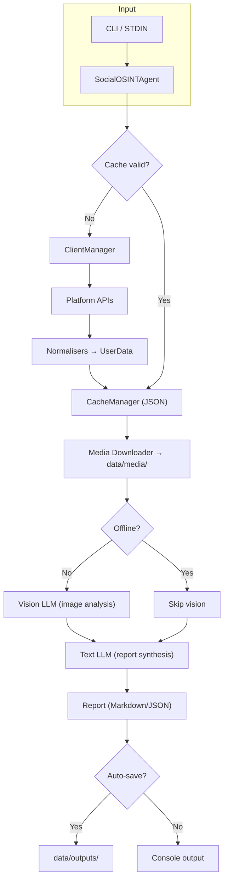

## Generation Metadata
- **Model:** cns-meta-glm5-k2.5-p18
- **Conversation ID:** 01kh79d8kcrcvzeb06pqnp60vz
- **Context Files:** owasp-social-osint-agent/docker-compose.yml, owasp-social-osint-agent/Dockerfile, owasp-social-osint-agent/env.example, owasp-social-osint-agent/input.json.example, owasp-social-osint-agent/LICENSE.md, owasp-social-osint-agent/README.md, owasp-social-osint-agent/requirements-dev.txt, owasp-social-osint-agent/requirements.txt, owasp-social-osint-agent/socialosintagent/analyzer.py, owasp-social-osint-agent/socialosintagent/cache.py, owasp-social-osint-agent/socialosintagent/client_manager.py, owasp-social-osint-agent/socialosintagent/cli_handler.py, owasp-social-osint-agent/socialosintagent/exceptions.py, owasp-social-osint-agent/socialosintagent/__init__.py, owasp-social-osint-agent/socialosintagent/llm.py, owasp-social-osint-agent/socialosintagent/main.py, owasp-social-osint-agent/socialosintagent/platforms/bluesky.py, owasp-social-osint-agent/socialosintagent/platforms/github.py, owasp-social-osint-agent/socialosintagent/platforms/hackernews.py, owasp-social-osint-agent/socialosintagent/platforms/__init__.py, owasp-social-osint-agent/socialosintagent/platforms/mastodon.py, owasp-social-osint-agent/socialosintagent/platforms/reddit.py, owasp-social-osint-agent/socialosintagent/platforms/twitter.py, owasp-social-osint-agent/socialosintagent/prompts/image_analysis.prompt, owasp-social-osint-agent/socialosintagent/prompts/system_analysis.prompt, owasp-social-osint-agent/socialosintagent/pytest.ini, owasp-social-osint-agent/socialosintagent/tests/conftest.py, owasp-social-osint-agent/socialosintagent/tests/__init__.py, owasp-social-osint-agent/socialosintagent/tests/test_analyzer.py, owasp-social-osint-agent/socialosintagent/tests/test_cache.py, owasp-social-osint-agent/socialosintagent/tests/test_cli_handler.py, owasp-social-osint-agent/socialosintagent/tests/test_github.py, owasp-social-osint-agent/socialosintagent/tests/test_llm.py, owasp-social-osint-agent/socialosintagent/tests/test_reddit.py, owasp-social-osint-agent/socialosintagent/tests/test_twitter.py, owasp-social-osint-agent/socialosintagent/tests/test_utils.py, owasp-social-osint-agent/socialosintagent/utils.py
- **Original Prompt:**
```text

Write a comprehensive readme in a style that is professional. After the readme conclude with your own thoughts on how to develop the project further.
```


[](https://opens
ource.org/licenses/MIT)  
[](https://ww
w.python.org/downloads/)  
[](https://www.
docker.com/)

**An autonomous, multi‑platform OSINT engine that harvests public social‑media dat
a, enriches it with vision‑capable Large Language Models (LLMs), and produces stru
ctured, evidence‑based investigative reports.**


---  

## Table of Contents
- [Generation Metadata](#generation-metadata)
- [Table of Contents](#table-of-contents)
- [Executive Summary](#executive-summary)
- [Key Features](#key-features)
- [System Architecture](#system-architecture)
- [Supported Platforms](#supported-platforms)
- [Installation \& Setup](#installation--setup)
  - [Docker (recommended)](#docker-recommended)
  - [Local Python Development](#local-python-development)
- [Configuration](#configuration)
  - [Required LLM settings](#required-llm-settings)
  - [Optional OpenRouter headers](#optional-openrouter-headers)
  - [Platform credentials (add only what you need)](#platform-credentials-add-only-what-you-need)
- [Operational Modes](#operational-modes)
  - [Interactive CLI](#interactive-cli)
    - [In‑session commands](#insession-commands)
  - [Programmatic (STDIN) Mode](#programmatic-stdin-mode)
    - [CLI arguments](#cli-arguments)
  - [Offline Mode](#offline-mode)
- [Data Model \& Caching](#data-model--caching)
  - [Normalised `UserData` schema](#normalised-userdata-schema)
  - [Storage layout](#storage-layout)
- [Customising Prompts](#customising-prompts)
- [Security \& Compliance](#security--compliance)
- [Troubleshooting](#troubleshooting)
- [Contributing](#contributing)
- [License](#license)
- [Future Development Thoughts](#future-development-thoughts)

---  

## Executive Summary
The OWASP Social OSINT Agent automates the collection, normalisation, and analysis
 of publicly available social‑media activity. It follows a **two‑phase pipeline**:

1. **Phase 1 – Data Acquisition** – Parallel fetching of textual content and media
 files from all configured targets, with intelligent 24‑hour caching to minimise A
PI usage.  
2. **Phase 2 – Vision & Synthesis** – Optional vision analysis of downloaded image
s (JPEG, PNG, GIF, WEBP) via a vision‑capable LLM, followed by a text‑LLM‑driven s
ynthesis that injects the current UTC timestamp to avoid temporal hallucinations.

Every insight is anchored to a clickable Markdown link to the original post or ima
ge, ensuring full evidential traceability. The tool can operate completely offline
 using cached data, making it suitable for air‑gapped investigations.  

---  

## Key Features
| Feature | Description |
|---------|-------------|
| **Multi‑platform aggregation** | Twitter/X, Reddit, Bluesky, Mastodon, GitHub, H
acker News |
| **Unified `UserData` schema** | Normalises heterogeneous API responses into a co
mmon TypedDict |
| **Vision‑enabled image analysis** | OCR, object detection, scene description; re
sults cached per‑image |
| **Temporal awareness** | Current UTC timestamp injected into system prompts |
| **Two‑phase workflow** | Fast text collection → optional slower vision analysis 
|
| **Robust caching** | 24 h TTL for API data, persistent media storage with MD5 de
duplication, offline fallback |
| **Rich interactive CLI** | Menus, progress spinners, cache‑status tables, help c
ommands (built with **rich**) |
| **Programmatic mode** | JSON configuration via `--stdin` for CI/CD or batch proc
essing |
| **Docker‑first distribution** | Reproducible environment; host‑mounted `data/` a
nd `logs/` volumes |
| **Extensible architecture** | Platform fetchers, client manager, and LLM analyze
r are modular and test‑covered |

---  

## System Architecture


* **SocialOSINTAgent** (`analyzer.py`) – orchestrates the whole pipeline, handles 
rate‑limit back‑off, and builds the final report.  
* **ClientManager** (`client_manager.py`) – lazy creation of Tweepy, PRAW, Atproto
, Mastodon clients, with credential validation.  
* **CacheManager** (`cache.py`) – file‑based JSON cache, 24 h TTL, offline‑mode ov
erride, LRU path caching.  
* **LLMAnalyzer** (`llm.py`) – loads external prompts, calls text and vision model
s via an OpenAI‑compatible endpoint.  
* **Platform fetchers** (`socialosintagent/platforms/*.py`) – each implements `fet
ch_data()` returning a normalized `UserData` object.  

---  

## Supported Platforms
| Platform | Data Types | Authentication | Rate‑limit handling |
|----------|------------|----------------|----------------------|
| **Twitter/X** | Tweets, media, metrics | Bearer token (v2 API) | Header parsing,
 exponential back‑off |
| **Reddit** | Submissions, comments, karma | OAuth2 client ID/secret + user‑agent
 | 60 req/min for OAuth2 |
| **Bluesky** | Posts, images, profile | App password | Cursor‑based pagination wi
th JWT |
| **Mastodon** | Toots, media (multi‑instance) | Access token | Per‑instance token
 bucket |
| **GitHub** | Public events, repos | Personal access token (optional) | Condition
al requests via ETag |
| **Hacker News** | Stories & comments | None | Algolia API, results cached |

---  

## Installation & Setup  

### Docker (recommended)
```bash
git clone https://github.com/bm-github/owasp-social-osint-agent.git
cd owasp-social-osint-agent
cp env.example .env                # edit to add your API keys
docker-compose build
docker-compose run --rm social-osint-agent   # starts the interactive CLI
```

### Local Python Development
```bash
python -m venv .venv
source .venv/bin/activate          # Windows: .venv\Scriptsctivate
pip install -r requirements-dev.txt
cp env.example .env
# edit .env with your credentials
python -m socialosintagent.main
```

Both approaches create a `data/` directory on the host that persists **cache**, **
media**, and **outputs** across container runs.

---  

## Configuration
All settings live in a `.env` file (copy from `env.example`).

### Required LLM settings
```dotenv
LLM_API_KEY="your_api_key"
LLM_API_BASE_URL="https://api.openrouter.ai/v1"   # or OpenAI, Azure, etc.
ANALYSIS_MODEL="gpt-4o"            # text synthesis
IMAGE_ANALYSIS_MODEL="gpt-4o"      # vision‑capable model
```

### Optional OpenRouter headers
```dotenv
OPENROUTER_REFERER="http://localhost:3000"
OPENROUTER_X_TITLE="SocialOSINTAgent"
```

### Platform credentials (add only what you need)
```dotenv
# Twitter/X
TWITTER_BEARER_TOKEN="..."

# Reddit
REDDIT_CLIENT_ID="..."
REDDIT_CLIENT_SECRET="..."
REDDIT_USER_AGENT="SocialOSINTAgent/1.0"

# Bluesky
BLUESKY_IDENTIFIER="handle.bsky.social"
BLUESKY_APP_SECRET="..."   # App password, not main password

# Mastodon (multiple instances supported)
MASTODON_INSTANCE_1_URL="https://mastodon.social"
MASTODON_INSTANCE_1_TOKEN="..."
MASTODON_INSTANCE_1_DEFAULT="true"

# GitHub (optional, raises rate limits)
GITHUB_TOKEN="..."
```

> **Security note:** never commit the `.env` file. Set file permissions to `600` o
n Unix systems.

---  

## Operational Modes  

### Interactive CLI
```bash
docker-compose run --rm social-osint-agent
```
1. **Select platform(s)** – single platform or “cross‑platform”.  
2. **Enter usernames** (comma‑separated).  
   *Twitter*: `username` (no `@`)  
   *Reddit*: `username` (no `u/`)  
   *Bluesky*: `handle.bsky.social`  
   *Mastodon*: `user@instance.domain`  
3. **Set default fetch count** (minimum 5).  
4. **Enter a natural‑language query** (e.g., “What are the user’s primary technica
l interests?”).  

#### In‑session commands
| Command | Effect |
|---------|--------|
| `loadmore <count>` | Fetch additional `count` items for the current target. |
| `loadmore <platform>/<user> <count>` | Targeted increment for a specific user. |
| `refresh` | Bypass cache and re‑fetch all data (disabled in offline mode). |
| `cache status` | Show a table of cached users, age, and media counts. |
| `purge data` | Interactive deletion of cache, media, or output files. |
| `help` | Show command help. |
| `exit` | Return to the platform‑selection menu. |

Reports are rendered in the terminal (Markdown) and automatically saved to `data/o
utputs/` unless `--no-auto-save` is supplied.

### Programmatic (STDIN) Mode
For automation or CI/CD pipelines:

```bash
cat investigation.json | docker-compose run --rm -T social-osint-agent --stdin --f
ormat json
```

**`investigation.json` schema (minimum fields)**
```json
{
  "platforms": {
    "twitter": ["alice", "bob"],
    "github": ["torvalds"]
  },
  "query": "Summarise technical expertise and sentiment across platforms.",
  "fetch_options": {
    "default_count": 50,
    "targets": {
      "twitter:alice": {"count": 200}
    }
  }
}
```

#### CLI arguments
| Flag | Description |
|------|-------------|
| `--stdin` | Read JSON config from STDIN (non‑interactive). |
| `--format [json|markdown]` | Output format for saved reports (default `markdown`
). |
| `--no-auto-save` | Do not write the report automatically. |
| `--offline` | Use only cached data; skip every network request. |
| `--log-level` | Set logging verbosity (`DEBUG`, `INFO`, `WARNING`, `ERROR`). |

### Offline Mode
```bash
docker-compose run --rm social-osint-agent --offline
```
All data is taken from the local cache; no API calls (including LLM calls if combi
ned with `--no-auto-save`). Ideal for air‑gapped environments or for re‑analysing 
previously collected material.

---  

## Data Model & Caching  

### Normalised `UserData` schema
```python
UserData = {
    "profile": {
        "platform": str,
        "id": str,
        "username": str,
        "display_name": Optional[str],
        "bio": Optional[str],
        "created_at": Optional[datetime],
        "profile_url": str,
        "metrics": Dict[str, int],
    },
    "posts": [
        {
            "id": str,
            "created_at": datetime,
            "author_username": str,
            "text": str,
            "media": [
                {
                    "url": str,
                    "local_path": str,          # MD5‑hashed filename
                    "type": str,                # image / video / gif
                    "analysis": Optional[str],  # Vision‑LLM output
                }
            ],
            "external_links": List[str],
            "post_url": str,
            "metrics": Dict[str, int],
            "type": str,                     # post, comment, submission, etc.
            "context": Optional[Dict],
        }
    ],
    "timestamp": datetime,                # cache write time
    "stats": Dict[str, Any],
}
```

### Storage layout
```
data/
├── cache/      # JSON API responses (24 h TTL online, always used offline)
├── media/      # Downloaded images/videos (MD5‑hashed filenames)
└── outputs/    # Generated reports (markdown or JSON)
```

* **Cache validity** – 24 h TTL when online; stale entries are still returned in o
ffline mode.  
* **Media deduplication** – identical URLs map to the same hash‑named file.  
* **Vision‑analysis caching** – the `analysis` field is persisted back into the us
er’s cache file, preventing duplicate LLM calls.  

---  

## Customising Prompts
Prompt files are stored in `socialosintagent/prompts/`:

| Prompt file | Purpose |
|-------------|---------|
| `system_analysis.prompt` | System message that guides the final textual synthesi
s. |
| `image_analysis.prompt` | Instructions for the vision model when analysing image
s. |

Edit these files to change the agent’s analytical style, depth, or focus without t
ouching any Python code.

---  

## Security & Compliance
* **Credential isolation** – all secrets are read from environment variables; neve
r logged or written to reports.  
* **Local data storage** – everything resides under `./data/`. Apply file‑system p
ermissions or full‑disk encryption when handling sensitive investigations.  
* **Provider data handling** – image data is transmitted to the configured LLM pro
vider during vision analysis; review the provider’s privacy policy.  
* **Legal compliance** – ensure usage complies with each platform’s Terms of Servi
ce and applicable privacy regulations (GDPR, CCPA, etc.).  

> **Disclaimer:** This tool is intended for lawful OSINT investigations and author
ized security research. Misuse is prohibited.

---  

## Troubleshooting  

| Symptom | Likely cause | Fix |
|---------|--------------|-----|
| Rate‑limit error (e.g., “429 Too Many Requests”) | API quota exhausted | The CLI
 prints a red panel with reset information. Reduce `fetch_limit`, use `loadmore` s
paringly, or add a proxy to spread requests. |
| Authentication failure | Invalid or missing token | Verify that the token matche
s the required format (Twitter Bearer token, Reddit client secret, Mastodon access
 token) and that required scopes are granted. |
| Vision analysis not triggered | Model does not support images or media missing |
 Confirm `IMAGE_ANALYSIS_MODEL` is a vision‑capable model (e.g., `gpt-4o`). Ensure
 the image exists under `data/media/`. |
| Docker volume permission errors | Host user does not own `data/`/`logs/` | Run `
sudo chown -R $(id -u):$(id -g) ./data ./logs`. |
| Cache not loading | Corrupt or outdated cache file | The agent automatically dis
cards invalid caches; delete the offending file or run `purge data` → `Cache`. |

---  

## Contributing
1. Fork the repository.  
2. Create a feature branch (`git checkout -b feature/awesome`).  
3. Implement changes adhering to PEP 8, with full type hints.  
4. Add/modify tests (`pytest -v`).  
5. Update documentation (README, prompts) as needed.  
6. Open a Pull Request.

All contributions must retain the unified `UserData` schema and pass the existing 
test suite.

---  

## License
Distributed under the **MIT License**. See `LICENSE.md` for the full text.

---  

## Future Development Thoughts
The current implementation provides a solid, modular foundation. The following enh
ancements would raise the agent from a powerful CLI utility to a full‑featured OSI
NT platform suitable for enterprise and research environments:

1. **Asynchronous Data Fetching**  
   Refactor `SocialOSINTAgent` to use `asyncio` (or a thread pool) so that API cal
ls to Twitter, Reddit, Bluesky, etc., run concurrently. This could cut cross‑platf
orm collection time by 60 %‑70 % while still respecting per‑service rate limits vi
a semaphores.

2. **Knowledge‑Graph Export**  
   Add a `--format graph` mode that emits GraphML or Neo4j‑compatible JSON. Nodes 
would represent users, domains, topics, and media; edges would capture mentions, s
hared links, and temporal relationships. Investigators could then visualise influe
nce maps in Gephi, Maltego, or Neo4j.

3. **EXIF & Media Forensics**  
   Before sending an image to the vision LLM, extract EXIF metadata (GPS, device m
odel, timestamps) with `piexif` or `exiftool`. Inject this hard evidence into the 
image‑analysis prompt, enabling the agent to correlate visual clues with geolocati
on or device‑fingerprinting data.

4. **Plugin Architecture for New Platforms**  
   Turn the static `FETCHERS` dictionary into a dynamic plugin loader (e.g., scann
ing a `plugins/` directory). Community members could drop in a `linkedin.py` or `t
elegram.py` module that implements the `fetch_data()` contract, extending coverage
 without modifying core code.

5. **Retrieval‑Augmented Generation (RAG) via Vector Store**  
   Index every fetched post in a lightweight vector database (ChromaDB, SQLite‑VSS
). When a user poses a query, retrieve the most semantically relevant chunks and f
eed only those to the text LLM, sidestepping context‑window limits for large histo
ries.

6. **Enhanced Vision Pipeline**  
   * **Perceptual hashing** to deduplicate visually similar images across platform
s.  
   * **Video key‑frame extraction** for limited video analysis.  
   * **Batch vision calls** where the provider permits multi‑image payloads, reduc
ing latency.

7. **Web API & Dashboard**  
   Wrap the core engine in a FastAPI service and provide a lightweight React UI. F
eatures would include live progress, cached‑data browsing, interactive graph visua
lisation, and a REST endpoint for SOAR integration.

8. **Operational Security (OPSEC) Additions**  
   * Global `PROXY_URL` env var that is injected into all HTTP clients (httpx, Twe
epy, PRAW) for Tor/SOCKS5 routing.  
   * Optional at‑rest encryption of `data/` using `cryptography.Fernet`.  
   * Auditable logging of who ran which query and on which targets.

9. **STIX/TAXII Export**  
   Offer an optional `--format stix` that produces a STIX‑2.1 bundle, enabling dir
ect ingestion into threat‑intel platforms such as MISP or Splunk.

Implementing these upgrades would preserve the current codebase’s clarity while dr
amatically expanding scalability, analytical depth, and integration potential.
